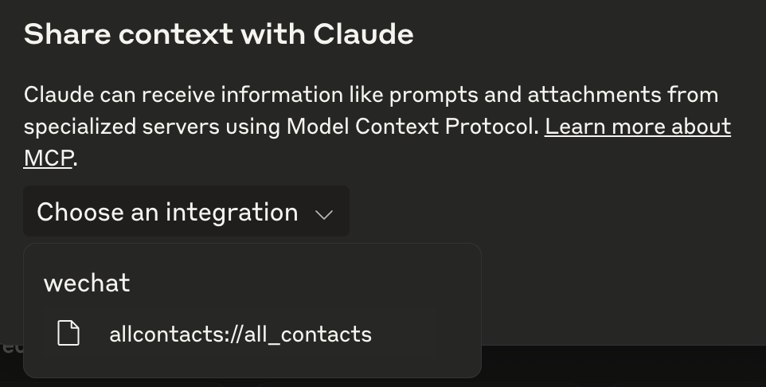

# WeChat MCP

Work-In-Progress Documentation

## 依赖

- Mac 微信 3.x
- 电脑里装好 `uv`
- 更具 [wechat-exporter](https://github.com/JettChenT/wechat-exporter/blob/main/README.cn.md) 的教程安装修改版微信

## 使用

在 `claude_desktop_config.json` 中添加:

```json
{
    "mcpServers": {
        "wechat": {
            "command": "uv",
            "args": [
                "--directory",
                "/Users/bytedance/Developer/llm-tools/wechat-mcp",
                "run",
                "-m",
                "src.mcp"
            ]
        }
    }
}
```

然后进入 claude desktop, enable MCP 即可

使用时建议每一个 conversation 都 share context 加入 `allcontacts://all_contacts` 这个 resource。



这个MCP提供以下功能:
- 读取与某用户的聊天记录
- 发送消息给某用户
